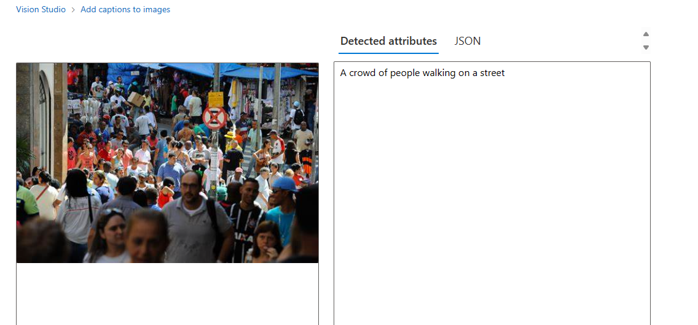

# dioAIzure
Ao entrar no portal azure clicamos em criar um recurso, escolhemos em categorias IA+MACHINE LEARNING, opção serviços cognitivos, e clicamos em criar, em detalhes do projeto, escolhemos o grupo de recursos, se não tiver pode criar, ainda na criar do serviço cognitivo, em detalhe da instancia, escolhemos Região (é bom deixar na que ja vem), em nome você escolhe o nome de sua preferencia, em tipo de preço escolhe a opção recomendada a abaixo, e marca de termos, e clicar em examinar+criar.
Após criar, vai para o portal https://portal.vision.cognitive.azure.com/
e lá escolhe View all resources, e seleciona o que você criou e fecha clicando no x no canto, pois isso vai rolando a barra e clica em Detect faces in an image, e em try it out marca a caixinha, e lá você pode colocar uma imagem de sua preferencia para fazer  detecção da faces.
no opção optical character recognition, clicando em Extract text from images, você pode extrair textos que estão na imagem.
E em add captions to images, o IA descreve a imagem.

